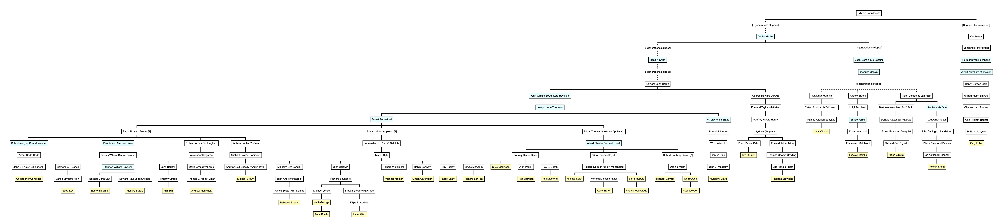
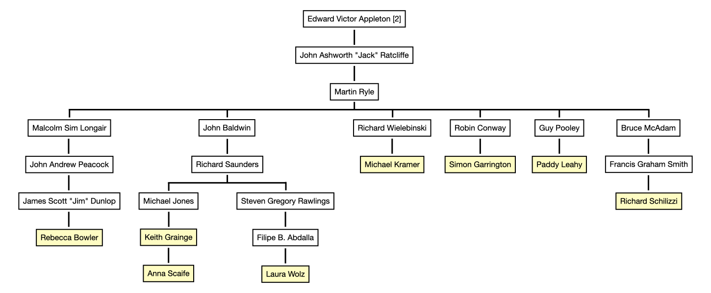

# JBTreeA: an academic family tree of Jodrell Bank Centre for Astrophysics staff

- - - -

A few months ago, a question occurred to me: how far back would you have to go to find someone who everyone in JBCA is academically descended from? The answer turned out to be "further back than I expected", but I was able to find a conclusive answer: a man named [Niccolò Leoniceno](https://en.wikipedia.org/wiki/Niccol%C3%B2_Leoniceno), who graduated from the University of Padua around 1453. On the way there, I found out that there were a lot of famous names in the JBCA lineage, and so decided that I should try to visualise how everyone is related academically. Here's the result.

JBCA staff are highlighted in yellow, while some famous names in physics and astronomy are highlighted in blue.

The tree follows Ph.D. supervisor-student relationships whenever possible. Before Ph.D.s were awarded, I've instead followed supervisor-graduate student or supervisor-research assistant.

This image can be downloaded from this repo so you can zoom in and read it more easily, and each of the major branches is shown below.

- - - -

## Appleton branch

Academic descendants of Edward Appleton. Everyone in this branch also descends from Ernest Rutherford, Joseph John Thomson, Lord Rayleigh, Edward Routh, Isaac Newton and Galileo.

[2] - There's some disagreement over whether Rutherford was Appleton's supervisor or Appleton was just a research assistant, but Appleton also descends from Thomson regardless.

## Appleyard branch

Academic descendants of Edgar Appleyard. Everyone in this branch also descends from Ernest Rutherford, Joseph John Thomson, Lord Rayleigh, Edward Routh, Isaac Newton and Galileo.

[3] - Brown was awarded his D.Sc. while working for Lovell in recognition for his contributions to radio astronomy, so didn't have a formal supervisor relationship with him. In the same way I treated researchers from before Ph.D.s were awarded, I'm counting the research mentor link instead.

## Bragg branch

Academic descendants of W. Lawrence Bragg. Everyone in this branch also descends from Joseph John Thomson, Lord Rayleigh, Edward Routh, Isaac Newton and Galileo.

## Cassini branch

Academic descendants of Jean-Dominique Cassini (and his son). Everyone in this branch also descends from Galileo.

## Darwin branch

Not that Darwin; academic descendants of George Darwin. Everyone in this branch also descends from Edward Routh, Isaac Newton and Galileo.

## Fowler branch

Academic descendants of Ralph Fowler. Everyone in this branch also descends from Ernest Rutherford, Joseph John Thomson, Lord Rayleigh, Edward Routh, Isaac Newton and Galileo.

[1] - There's some disagreement over whether Rutherford was Fowler's supervisor or Fowler was just a research assistant. Without using the link to Rutherford, I haven't yet been able to link Fowler's line up to the rest of the family tree.

## Helmholtz branch

Academic descendants of Hermann von Helmholtz. This branch is the most distant from all others; everyone in this branch descends from Niccolò Leoniceno.

- - - -

Some additional notes:

Because many people had more than one Ph.D. supervisor or mentor, this is only one possible configuration of the family tree; for example, Chandrasekhar was supervised by both Fowler and Milne, and I could've traced his lineage through either supervisor. As such, you may be able to find a closer link between people than shown here.

To my knowledge, everything shown here is accurate, but if you spot any issues please email me at fiona.porter@manchester.ac.uk.

- - - - 

Much of the research done here should be credited to [academictree.org](https://academictree.org/) and [AstroGen](https://astrogen.aas.org/front/index.php) (the Astronomy Genealogy Project), who provide detailed academic family tree data. Both of them are maintained and updated by volunteers, so exploring and adding records to them is encouraged! I'd also like to thank all of the staff who responded to my rather out of the blue emails asking them nosy questions about their supervisors, as without them I couldn't have finished this.
